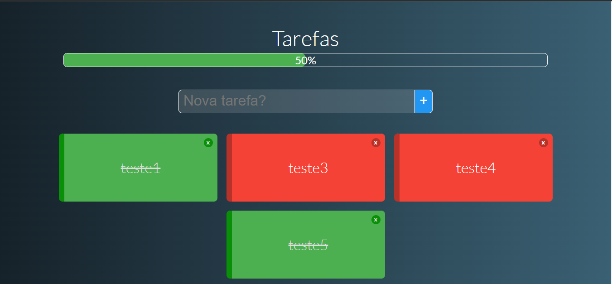

# Lista de tarefas (TODO)
## Introdução
O projeto funciona como uma lista de tarefas. É possível adicionar uma nova tarefa e marcar uma tarefa como finalizada ao clicar. Além de manipular as tarefas, pode-se visualizar a porcentagem total de tarefas finalizadas. As ações realizadas durante a utilização do projeto são gravadas em localStorage para evitar perda de informação.

## Execução
Para executar o projeto basta rodar os dois comandos a seguir.

### Setup do projeto
```
npm install
```

### Compilar para desenvolvimento
```
npm run serve
```

## Preview

